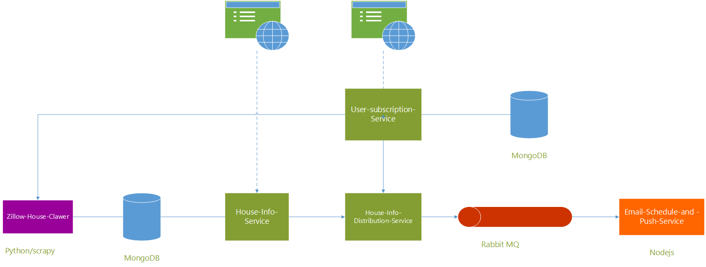

# Spring-Cloud-SkadiHouse

## Introduction
A house information crawling and pushing project for real estate. House information will crawled from internet, and data will be periodic analyzed and push to subscribed user by email.
## Project Architecture
<p align="center">
  
</p>

## Get Started
### Running Infrastructure
- Install Docker 
  ``` 
  sudo apt-get install docker.io
  ```
- Start MongoDB and RabbitMQ by running ```docker-compose.yml``` under project root
  ```
  docker-compose up
  ```
### Build project
- Build each microservices under project root
  ```
  mvn clean install
  ```
### Run HouseInfo Crawler
- Install python 2, pip and scrapy
- Set zip or city to be crawed in the `search_area.txt`
- In the crawler root run
  ```
  pip install -r requirements.txt 
  ```
- Run crawler
  ```
  scrapy crawl skadihouse
  ```

### Run Spring-Cloud
- Running following commond in different terminal for each eureka and hystrix-dashboard
  ```
  java -jar ./platform/eureka/target/eureka-0.0.1-SNAPSHOT.jar 
  java -jar ./platform/hystrix-dashboard/target/hystrix-dashboard-0.0.1-SNAPSHOT.jar 
  ```
- Running following commond in different terminal for each microservices
  ```
   java -jar xxx/target/xxx.jar
  ```
### Run Email-Consumer-Service with Nodejs
- Install node.js and npm
- In Email-Consumer-Service root run 
  ```
  npm install
  ```
- run service
  ```
  npm start
  ```


## HouseInfo and User Suscribe Web frontend
  - http://localhost:9000

## Tritoneat Design Detail
 <a href="Document/SkadiHouse Design.pdf">SkadiHouse Detail Design</a>